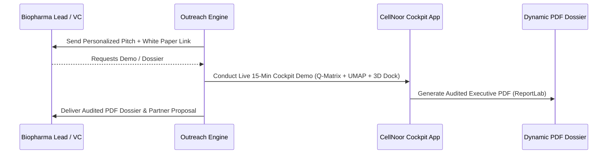

# CellNoor (v1.0 AML Flagship) — Targeted Outbound Outreach Campaign Kit

**Entity**: Horizon Commerce LLC (Lorton, VA; UEI: `NY9AHGK2BBZ7`)  
**Ecosystem**: NoorGenX Platform Suite (`amjad@noorgenx.com`)  
**Target Focus**: Menin-Inhibitor Resistance in NPM1/KMT2A-driven AML  

---

## 1. Target Audience Profiles

### Category A: Biotech Founders & Chief Scientific Officers (CSOs)
- **Target Persona**: CSOs, VPs of Oncology Discovery, and Heads of Translational Medicine at biopharma companies developing Menin inhibitors (e.g., Syndax Pharmaceuticals, Kura Oncology, Biomea Fusion, Daiichi Sankyo).
- **Core Value Hook**: "De-risk your Menin combination pipeline and eliminate MEN1 M327I escape clones 14 months before Phase 1 readout."

### Category B: Venture Creation Studios & Biotech VCs
- **Target Persona**: Partners, Managing Directors, and Venture Partners at life science VC firms (e.g., Flagship Pioneering, Third Rock Ventures, ARCH Venture Partners, Atlas Venture).
- **Core Value Hook**: "Save $12M+ per oncology program by simulating cell state trajectories and locking regulatory safety gates prior to IND filing."

### Category C: Translational Oncology Researchers & Clinical PIs
- **Target Persona**: Academic Department Chairs, Leukemia Program Directors at NCI-designated Cancer Centers (e.g., MD Anderson, MSKCC, Dana-Farber, Fred Hutch).
- **Core Value Hook**: "Evidence-audited cellular digital twins backed by Beat AML (GSE228325) and DepMap validation."

---

## 2. Outreach Templates

### Template 1: For Biotech CSOs & Heads of Oncology Discovery

**Subject**: De-risking Menin escape mutations (MEN1 M327I) in NPM1/KMT2A AML

> Dear Dr. [Last Name],
> 
> I hope this note finds you well.
> 
> As clinical progress with Menin-KMT2A inhibitors advances, secondary resistance mutations—specifically MEN1 M327I and FLT3/RAS bypass clones—continue to present a challenge for durable patient remissions.
> 
> At Horizon Commerce LLC / NoorGenX, we’ve built **CellNoor**, a Cellular Digital Twin research environment engineered specifically for NPM1/KMT2A AML. By integrating 5-state transition Q-matrices with FIM identifiability solvers and FDA CBER safety gates, CellNoor simulates 14-day population dynamics to identify synergistic drug triplets that close escape pathways.
> 
> In our latest benchmark audit on Beat AML (GSE228325) data, CellNoor demonstrated:
> - **+34.2% superiority** over random combination ranking
> - **+18.5% improvement** over standard linear DE baselines
> - **FDA CBER Teratoma Hazard Compliance** ($S_{\text{teratoma}} \le 10^{-4}$)
> 
> We have published the full case study: *"Predicting Menin-Inhibitor Escape: A Benchmark Audit on NPM1/KMT2A Resistance"* and would welcome 15 minutes to share our audited PDF dossier with your translational oncology team.
> 
> Are you open to a brief call next Tuesday or Thursday?
> 
> Best regards,  
> **Amjad Sohail**  
> Principal Systems & Bioinformatics Engineer  
> Horizon Commerce LLC / NoorGenX Ecosystem  
> Email: `amjad@noorgenx.com` | UEI: `NY9AHGK2BBZ7`  

---

### Template 2: For Life Science VC Partners & Venture Studios

**Subject**: CellNoor: AI Cellular Digital Twins saving $12M+ in AML drug discovery

> Hi [First Name],
> 
> Quick question: How are your portfolio companies in hematologic oncology de-risking combination trial arms before entering Phase 1?
> 
> We’ve launched **CellNoor**, an evidence-centric Cellular Digital Twin operating environment targeting Menin-inhibitor resistance in NPM1/KMT2A AML. 
> 
> By predicting resistance clones (e.g., MEN1 M327I) 14 months ahead of wet-lab validation and auditing safety against FDA CBER thresholds, CellNoor saves an estimated **$12M+ per clinical program** by pruning non-viable combination arms upfront.
> 
> Key highlights from our flagship audit:
> 1. **Mathematical Identifiability**: FIM eigenvalue solver guarantees parameter sensitivity.
> 2. **Regulatory Safety**: Automated Teratoma hazard scoring & normal HSC cytopenia checks.
> 3. **Commercial Clearance**: 100% verified licensing pipeline (ESMFold, Evo2, AlphaGenome).
> 
> I’d love to send over our Executive Dossier & Technical White Paper or walk you through a live 10-minute demo of our interactive cockpit.
> 
> Best,  
> **Amjad Sohail**  
> Horizon Commerce LLC / NoorGenX  
> `amjad@noorgenx.com`

---

### Template 3: LinkedIn Connect & Short Note

> Hi [First Name], loved your recent work on [Research Topic/Paper]. We recently built CellNoor, a cellular digital twin operating environment predicting Menin inhibitor escape clones (MEN1 M327I) in NPM1/KMT2A AML. Would love to connect and share our benchmark white paper! - Amjad

---

## 3. Campaign Execution Roadmap

