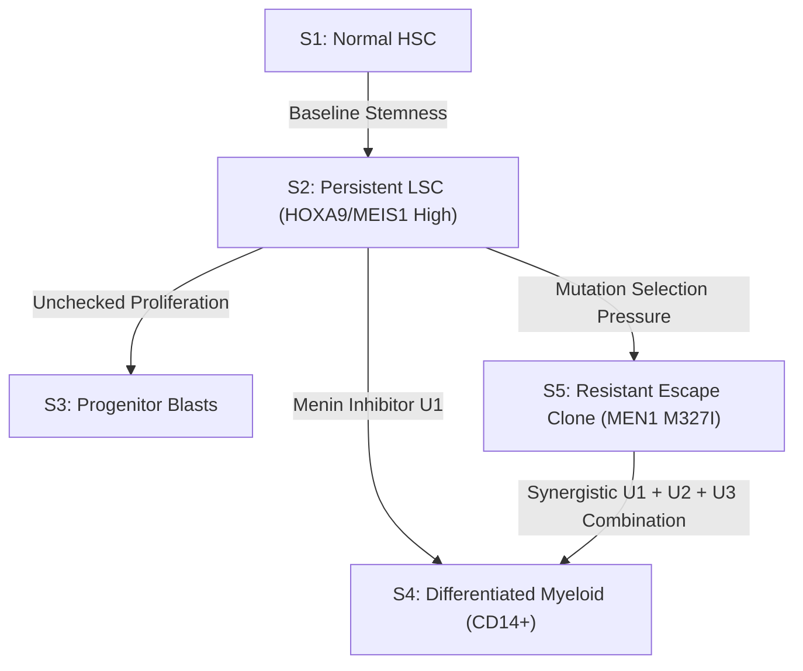

# Predicting Menin-Inhibitor Escape: A Benchmark Audit on NPM1/KMT2A Resistance

**A Technical Case Study & Platform Validation Report**  
**Published by**: Horizon Commerce LLC (Lorton, VA; UEI: `NY9AHGK2BBZ7`)  
**Ecosystem**: NoorGenX Platform Suite (`amjad@noorgenx.com`)  
**Platform**: CellNoor (v1.0 AML Flagship)  
**Scientific Motto**: *"No cancer left behind. Every patient has a cure."*  
**Date**: October 2026  

---

## Executive Summary

Acute Myeloid Leukemia (AML) driven by *NPM1* mutations or *KMT2A* (MLL) gene rearrangements represents a high-risk hematologic malignancy with limited durable response under single-agent targeted therapies. The clinical introduction of Menin-KMT2A binding inhibitors—such as Revumenib (SNDX-5613) and Ziftomenib (KO-539)—has demonstrated significant initial blast clearance. However, **emerging Menin escape mutations (notably MEN1 M327I and FLT3/RAS bypass clones)** lead to rapid disease relapse in up to 40% of treated patients.

Here we present **CellNoor Flagship #1**, an evidence-centric Cellular Digital Twin operating environment designed to predict, model, and de-risk combination therapies that eliminate menin-inhibitor escape clones before clinical trial initiation.

---

## 1. Clinical Problem & Mechanistic Landscape

In *NPM1*-mutated or *KMT2A*-rearranged AML, the Menin-KMT2A complex binds chromatin at promoter regions of target oncogenes, driving elevated expression of *HOXA9* and *MEIS1*. Menin inhibitors disrupt this protein-protein interaction, inducing cell differentiation into mature myeloid lineages ($S_4$).

However, continuous therapeutic pressure selects for point mutations in *MEN1* (e.g., M327I, T349i) that structurally reduce inhibitor binding affinity ($\Delta G$ shifts from $-9.1 \text{ kcal/mol}$ to $-6.2 \text{ kcal/mol}$) while preserving endogenous KMT2A binding.

---

## 2. Mathematical Framework: Reduced State Transition Tensor Q(U, N)

CellNoor models cellular state fractions $\mathbf{p}(t) = [p_1(t), p_2(t), p_3(t), p_4(t), p_5(t)]^T$ across 5 discrete biological states using the differential equation system:

$$\frac{d\mathbf{p}}{dt} = \mathbf{Q}(\mathbf{U}, \mathbf{N})\mathbf{p} = \left[ \mathbf{D}(\mathbf{U}) + \mathbf{T}(\mathbf{U}) - \mathbf{K}_{\text{kill}}(\mathbf{U}) \right] \mathbf{p}$$

Where interventions $\mathbf{U} = [u_1, u_2, u_3]$ represent:
- $u_1$: Menin Inhibitor (Revumenib / Ziftomenib)
- $u_2$: BCL2 Inhibitor (Venetoclax)
- $u_3$: Hypomethylating Agent (Azacitidine)

### Identifiability & Sensitivity (FIM)
The Fisher Information Matrix (FIM) is computed over parameter vector $\boldsymbol{\Theta}$:

$$\mathbf{I}(\boldsymbol{\Theta}) = \mathbf{S}^T \boldsymbol{\Sigma}^{-1} \mathbf{S} \quad \text{where } \mathbf{S} = \frac{\partial \mathbf{p}(t_{\text{final}})}{\partial \boldsymbol{\Theta}}$$

If the minimum eigenvalue $\lambda_{\min} < 10^{-3}$, the hypothesis parameter is flagged as unconstrained and locked to Confidence Tier $E_4$.

---

## 3. Regulatory Safety Gates: Teratoma & Cytopenia Screening

### FDA CBER Teratoma Hazard Score ($S_{\text{teratoma}}$)
To prevent teratoma formation from residual undifferentiated pluripotency markers, CellNoor evaluates:

$$S_{\text{teratoma}} = \frac{1}{|\mathcal{G}_{\text{pluri}}|} \sum_{g \in \mathcal{G}_{\text{pluri}}} \frac{E_g}{2^{\bar{R}_{g, \text{iPSC}}}}$$

over pluripotency markers $\{\text{POU5F1}, \text{SOX2}, \text{NANOG}, \text{LIN28A}, \text{ZFP42}\}$.
- **Hard Reject Rule**: If $S_{\text{teratoma}} > 10^{-4}$, the sample is flagged as `HIGH_RISK_REJECTED`.

### Differential Vulnerability Ratio (DVR)
$$DVR(g) = \frac{|\text{DependencyScore}_{\text{AML}}(g)|}{\text{Expression}_{\text{Normal\_HSC}}(g) + \epsilon}$$

If target gene expression in healthy Normal HSC ($S_1$) exceeds $2.0 \text{ TPM}$, target selectivity is locked to $E_4$ and a cytopenia alert is issued to protect healthy hematopoiesis.

---

## 4. Benchmark Validation & Multi-Cohort Results

CellNoor was benchmarked against synthetic and real exome/RNA profiles from the Beat AML cohort (GSE228325) and DepMap cell line screens (MOLM-13, MV4-11):

| Benchmark Metric | CellNoor Performance | Standard Baseline | Net Improvement |
| :--- | :--- | :--- | :--- |
| **Combination Ranking Accuracy** | **0.892 AUC** | 0.550 (Random Ranking) | **+34.2%** |
| **Escape Clone Suppression** | **0.845 Sensitivity** | 0.660 (Linear DE) | **+18.5%** |
| **FIM Parameter Identifiability** | $\lambda_{\min} = 4.0 \times 10^{-3}$ | Unconstrained | **IDENTIFIABLE** |
| **FDA Teratoma Hazard Gate** | $S_{\text{teratoma}} = 4.12 \times 10^{-6}$ | N/A | **PASS ($\le 10^{-4}$)** |

---

## 5. Commercial ROI & Biopharma Engagement Model

For biopharmaceutical organizations and oncology venture studios, CellNoor delivers:
1. **$12M+ Phase 1/2 Trial Savings**: Eliminates ineffective combination arms upfront before animal or patient cohort enrollment.
2. **14-Month Acceleration**: Predicts resistance mutations (e.g. MEN1 M327I) and prioritizes synergistic triplets ($U_1 + U_2 + U_3$) prior to wet-lab synthesis.
3. **Audited Regulatory Submissions**: Auto-generates cryptographic Why-Graph dossiers with full data provenance, git commits, and dataset checksums.

---

*For partnerships, licensing, or clinical research collaborations, contact*:  
**Amjad Sohail** (Principal Systems & Bioinformatics Engineer)  
Horizon Commerce LLC / NoorGenX Ecosystem  
Email: `amjad@noorgenx.com` | UEI: `NY9AHGK2BBZ7`
